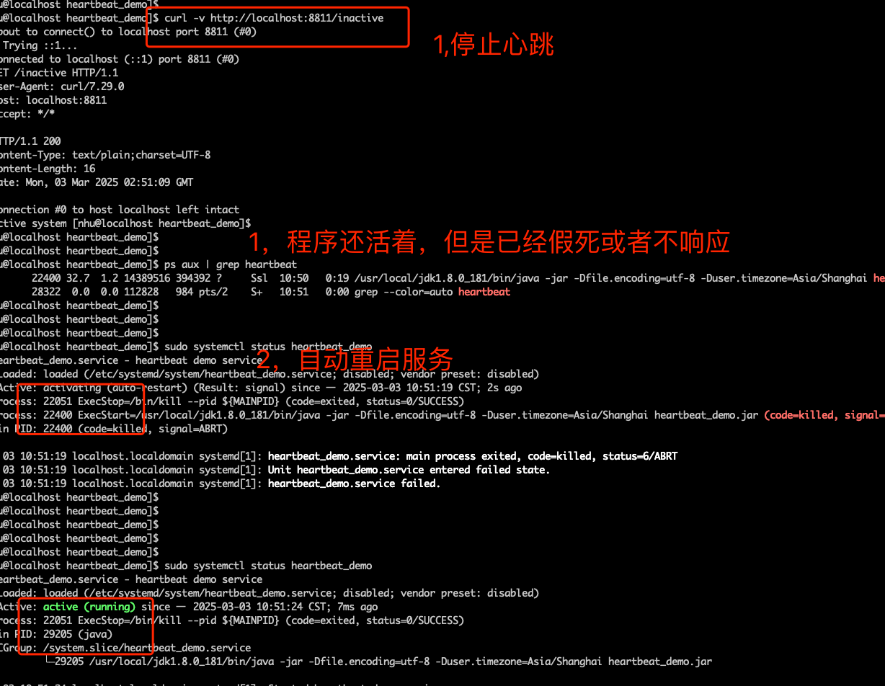

# systemdHeart

# 如何使用
### 1 引入包
```xml
  <dependency>
    <groupId>io.github.nice4work</groupId>
    <artifactId>systemdHeartbeat</artifactId>
    <version>1.0.1</version>
</dependency>
```

### 2  代码中添加一下语句，会自动判断是否支持systemd环境，如果支持，会自动与systemd进行交互

```java

ServiceLoader<Initializer> loader = ServiceLoader.load(Initializer.class);
        for (Initializer initializer : loader) {
        initializer.initialize();
        }
```


### 3 service文件添加一下配置

```service
KillMode=process
TimeoutStopSec=5
User=your_user_name
Group=your_group_name
WatchdogSec=10s
Restart=on-failure
RestartSec=5s
```
完整配置例子
```service
[Unit]
Description=formula engine service
After=network.target multi-user.target

[Service]
Type=simple
WorkingDirectory=/opt/xxxx
PIDFile=/opt/xxxx/application.pid
StandardOutput=null
StandardError=null
ExecStart=/usr/local/jdk1.8.0_181/bin/java -jar -Dfile.encoding=utf-8 -Dconfig.rdb.enable=true  -Duser.timezone=Asia/Shanghai xxxx.jar
ExecStop=/bin/kill --pid ${MAINPID}
TimeoutStopSec=10s
KillMode=process
WatchdogSec=30s
Restart=on-failure
RestartSec=10s

[Install]
WantedBy=multi-user.target


```


### 4 例子：



